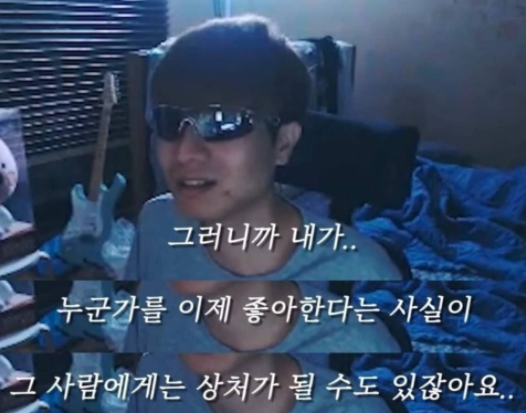

+++
date = '2026-04-02T07:18:41+09:00'
draft = false
title = '어바웃 타임 리뷰'
tags = ['인생영화', '멜로']
categories = ['ott']

+++

### 별점 : ★★★★★

[넷플릭스 링크](https://www.netflix.com/kr/title/70261674)

<iframe width="560" height="315" src="https://www.youtube.com/embed/iQop_qs4xV4?si=kLcCD-cxtr8vtgUH" title="YouTube video player" frameborder="0" allow="accelerometer; autoplay; clipboard-write; encrypted-media; gyroscope; picture-in-picture; web-share" referrerpolicy="strict-origin-when-cross-origin" allowfullscreen referrerpolicy="strict-origin-when-cross-origin"></iframe>

내 인생에서 단 한편의 영화맘 뽑아보라고 하면, 난 단연코 이 영화를 고를 거다.

빨간 드레스를 입은 레이첼 맥아담스의 신부 입장 모습은 정말 많은 사람들한테 야외 결혼식을 꿈꾸도록 한 것 같다. 그 중에 나도 있고 ㅋㅋ

영화의 스토리도, 영상미도, 연기도, 흠 잡을 곳 단 한군데도 없는 영화.

**죽기 전 꼭 한번은 봐야 하는 영화 !**

<iframe width="560" height="315" src="https://www.youtube.com/embed/-3Sil4oi_P0?si=uAyjejiqnqF0MgSc" title="YouTube video player" frameborder="0" allow="accelerometer; autoplay; clipboard-write; encrypted-media; gyroscope; picture-in-picture; web-share" referrerpolicy="strict-origin-when-cross-origin" allowfullscreen></iframe>

내가 가장 좋아하는 장면은 이 장면이다. 출퇴근 하는 지하철 역을 배경으로 ost가 흘러나오는 이 부분은 진짜...

상상으로만 했던 배우자와의 출퇴근을 너무 멋있게 표현해줬다.

---

<iframe width="560" height="315" src="https://www.youtube.com/embed/MM00yG5NHtY?si=uvDrojgd9xrhDSuQ" title="YouTube video player" frameborder="0" allow="accelerometer; autoplay; clipboard-write; encrypted-media; gyroscope; picture-in-picture; web-share" referrerpolicy="strict-origin-when-cross-origin" allowfullscreen></iframe>

나랑 교제했던 분들은 너무나 많은 노래로 남았고, 내겐 너무 과분한 사람들이었다.

함께했던 추억들, 미안한 마음들, 고마웠던 것들...

**"내가 사랑을 했던 모든 사람들을 사랑해"**

---

짝사랑은 각각 하나의 노래들을 남겼다.

<iframe width="560" height="315" src="https://www.youtube.com/embed/cziRSkXeWdU?si=v2BqP3el13Ee_0T5" title="YouTube video player" frameborder="0" allow="accelerometer; autoplay; clipboard-write; encrypted-media; gyroscope; picture-in-picture; web-share" referrerpolicy="strict-origin-when-cross-origin" allowfullscreen></iframe>

내 등대가 되어주길 바랬던,

<iframe width="560" height="315" src="https://www.youtube.com/embed/cHkDZ1ekB9U?si=5b5mG5yWAb-iCpne" title="YouTube video player" frameborder="0" allow="accelerometer; autoplay; clipboard-write; encrypted-media; gyroscope; picture-in-picture; web-share" referrerpolicy="strict-origin-when-cross-origin" allowfullscreen></iframe>

투박한 음악이 되어주고 싶었던,

<iframe width="560" height="315" src="https://www.youtube.com/embed/qr9i9jRuTug?si=GdAeUXQrElL4fZ7y" title="YouTube video player" frameborder="0" allow="accelerometer; autoplay; clipboard-write; encrypted-media; gyroscope; picture-in-picture; web-share" referrerpolicy="strict-origin-when-cross-origin" allowfullscreen></iframe>

손 잡고 걷고 싶었던,

노래로 남은 사람들...

어릴 땐 계속해서 들이대고 따라다니고 할 수 있었는데, 어느 날 인터넷 커뮤니티에서 이런 단어를 봤다. 고백폭행.

너무 슬픈 단어인 것 같다. 내 마음이 그사람에겐 폭력으로 느껴진다는 게...

