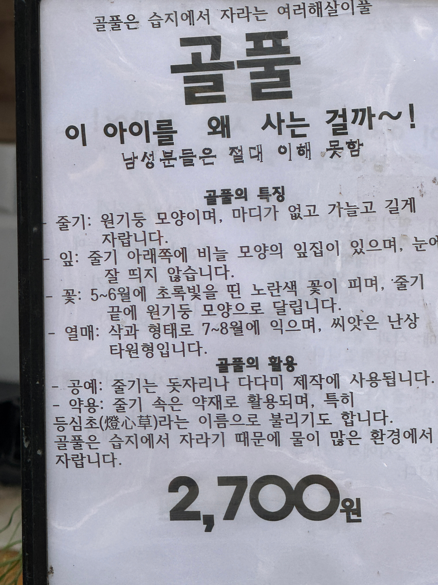
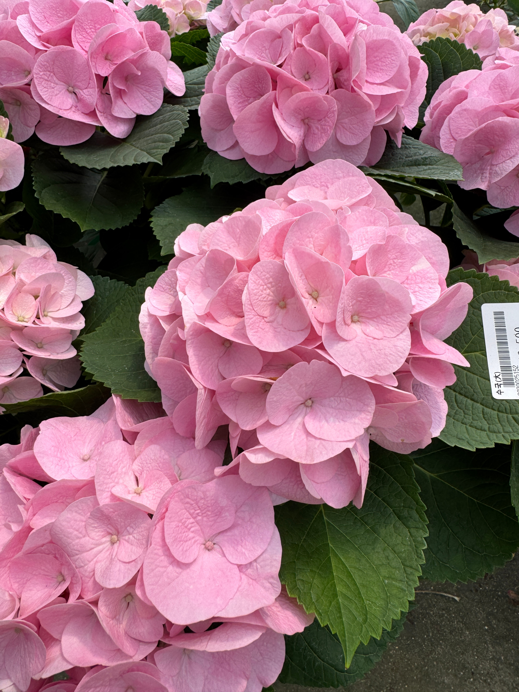
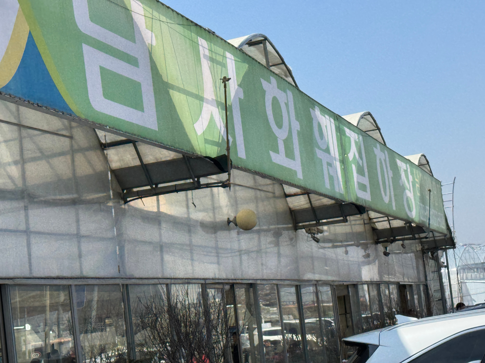

+++
date = '2026-04-05T16:28:42+09:00'
draft = false
title = '남사 화훼단지 리뷰'
tags = ['가족', '꽃']
categories = ['인생']

+++

### 별점 : ★★★★★

식목일 기념으로 남사 화훼단지를 다녀왔다. 사실은, 침대에 축 늘어져있는 내가 안쓰러우셨단다. 부모님의 사랑은 위대하다..

<iframe width="560" height="315" src="https://www.youtube.com/embed/ouR4nn1G9r4?si=qLWnLLoJYCRJth7j" title="YouTube video player" frameborder="0" allow="accelerometer; autoplay; clipboard-write; encrypted-media; gyroscope; picture-in-picture; web-share" referrerpolicy="strict-origin-when-cross-origin" allowfullscreen></iframe>

엄마가 꽃을 좋아하시기 때문에 가끔 간다. 너뎃군데의 구경스팟이 있지만, 오늘은 주말에다 식목일이라 그런지 사람이 너무 많아서 세 곳만 찍고 왔다.

<iframe src="https://www.google.com/maps/embed?pb=!1m18!1m12!1m3!1d3181.900287062254!2d127.15981760000001!3d37.107490999999996!2m3!1f0!2f0!3f0!3m2!1i1024!2i768!4f13.1!3m3!1m2!1s0x357b49d424174ae9%3A0x5ade621ed303f57c!2z7JiI7IKQ7ZSM65287JuM7JWE7Jq466Cb!5e0!3m2!1sko!2skr!4v1775374285991!5m2!1sko!2skr" width="600" height="450" style="border:0;" allowfullscreen="" loading="lazy" referrerpolicy="no-referrer-when-downgrade"></iframe>

예전에 둘째고모가 키우던 반려견 이름도 예삐였는데...

알록달록한 이 꽃들의 이름을 모두 맞추시면 소정의 상품을....드리지는 않습니다.

왜냐, 내가 이 꽃이 뭔 꽃인지 모르니까 ㅋㅋ 그냥 이뻐서 찍었다. (블로깅 하려고 찍은 것도 있고..)

첫 번째 선택받은 꽃 녀석..

**이 아이를 왜 사는 걸까~!** 남성분들은 절대 이해 못함

웃겨서 찍었다.

가까이서 보니까 이뻐보이기도 하고, 연가시 영화에서 봤던 것 같아서 징그럽기도 하고...오묘하다.

종이로 만든 꽃 같아서 찍었다. 겹겹이 생긴게 이뻤다.

---

<iframe width="560" height="315" src="https://www.youtube.com/embed/OxgiiyLp5pk?si=AzoVuBtJaLvN2Tzp" title="YouTube video player" frameborder="0" allow="accelerometer; autoplay; clipboard-write; encrypted-media; gyroscope; picture-in-picture; web-share" referrerpolicy="strict-origin-when-cross-origin" allowfullscreen></iframe>

<iframe src="https://www.google.com/maps/embed?pb=!1m18!1m12!1m3!1d3182.056077440722!2d127.1381806!3d37.1037826!2m3!1f0!2f0!3f0!3m2!1i1024!2i768!4f13.1!3m3!1m2!1s0x357b49829a56db59%3A0x1b0e6563115ef998!2z7ZWc7ZSM65287JuM7JWE7Jq466Cb!5e0!3m2!1sko!2skr!4v1775374700718!5m2!1sko!2skr" width="600" height="450" style="border:0;" allowfullscreen="" loading="lazy" referrerpolicy="no-referrer-when-downgrade"></iframe>

두 번째로 들렸던 곳

여긴 새로 생겼다고 하더라고. 그래서 그런지 사람이 별로 없었다.

식목일 기념 20% 

라고 써있는 할인하는 꽃이었다. 보자기처럼 싸여있다가 점점 펴지는 꽃이었다. 신기하고 이쁨!

아버지는 아버지 나름대로 열심히 보고 계시더라. 그래서 엄마랑 동생 뒷모습만 찍었다.

이 쯤이었나..? 꽃집에서 틀어놓은 라디오에서 박효신의 야생화가 들려서, 노래 첨부했다.

**희망을 가지세요**

희망이 없어요...

이 집은 다른 집보다 조금 더 비싸서 그냥 나왔음. 사람이 없어서 박리다매가 안되는건가?

---

<iframe width="560" height="315" src="https://www.youtube.com/embed/WxH1Vss1pLo?si=J8gjqT9wYYBJdeuq" title="YouTube video player" frameborder="0" allow="accelerometer; autoplay; clipboard-write; encrypted-media; gyroscope; picture-in-picture; web-share" referrerpolicy="strict-origin-when-cross-origin" allowfullscreen></iframe>

<iframe src="https://www.google.com/maps/embed?pb=!1m18!1m12!1m3!1d3181.9788896878217!2d127.13011970000001!3d37.10562!2m3!1f0!2f0!3f0!3m2!1i1024!2i768!4f13.1!3m3!1m2!1s0x357b480fcf1178cb%3A0xb75c065a3d2baf08!2z64Ko7IKs7ZmU7Zu87KeR7ZWY7J6l!5e0!3m2!1sko!2skr!4v1775375146362!5m2!1sko!2skr" width="600" height="450" style="border:0;" allowfullscreen="" loading="lazy" referrerpolicy="no-referrer-when-downgrade"></iframe>

마지막으로 들린 곳.

원래는 이후에 한군데를 더 들리려 했는데, 주차장으로 들어가려는 차가 너무 많이 기다리고 있어서 그냥 집에가자 하셨음. 나중에 평일에 한번 다시 모시고 가야지.

들어가자 마자 보인 프리지아. 그래서 마로니에 칵테일 사랑이 생각났다. 그런 의미에서 경서 버전으로...?!?!?!

검은색 꽃이 신기하고 이뻐서 찍었는데, 막 찍었더니 초점이 안맞네....좀 더 신경써서 찍을걸..ㅠ

완전 펴져서, 평면으로 보였다. 접시같이 생기고 이쁜 꽃!

이건 엄마가 찍어놓으래서 찍어놨는데, 엄마도 나도 까먹....구매하시려고 하셨던 거 같은데.

빨강 노랑 꽃들을 섞어서 배치해놔서, 사진보다 더 이뻤다. 확실히 눈보다 더 좋은 인풋 하드웨어가 없는거 같다.

남자는 핑크지! 사실 분홍과 보라색 사이 어딘가의 색이었음

둘 중 무엇을 살 까 고민하시던 어무이는...

짜잔! 둘 다 선택

이건 아까 위에 평면과는 완전 반대로, 반원형으로 엄청 입체적으로 피고 있어서 신기했다.

파란색 vs 분홍색

이것도 종이공예 같았다. 엄청 오묘하고 이쁜 색. 그라데이션 느낌도 나는.

회색에 가까운 초록색. 많이 어두운 느낌의 이파리를 가지고 있는데, 꽃은 정말 화사한 노랑이라 뭔가...절망 가운데서 핀 희망 같은 느낌? 이었다.

그렇게 구경하는 사이에 하나 더!

---

저녁 뭐먹을까 고민하다가, 일요일 1 + 1 도미노피자로 픽!  운전하느라 내가 시킬 수가 없어서 동생한테 시키라고 했더니 엄마가 자조섞인 말을 아버지한테 건네셨다.

**"우리는 도움이 안되는 사람들이야. 피자도 못시키고.."**

예전에, 키오스크 하실 줄 몰라서 햄버거 못사드셨다고 했던 게 문득 생각나서 슬펐다. 이번에 쉬는 기간동안 부모님 모시고 여기저기 많이 다녀야겠다..

PS...

<iframe width="560" height="315" src="https://www.youtube.com/embed/C8L14GcvFPw?si=hpBnrth3GjlBKB-8" title="YouTube video player" frameborder="0" allow="accelerometer; autoplay; clipboard-write; encrypted-media; gyroscope; picture-in-picture; web-share" referrerpolicy="strict-origin-when-cross-origin" allowfullscreen></iframe>

날씨가 좋아서 그런건지, 식목일이라 그런건지, 주말이라 그런건지, 커플들이 엄청 많더라. 신혼부부로 보이는 사람들도 많고...

봄이 좋냐! 멍청이들아!!

