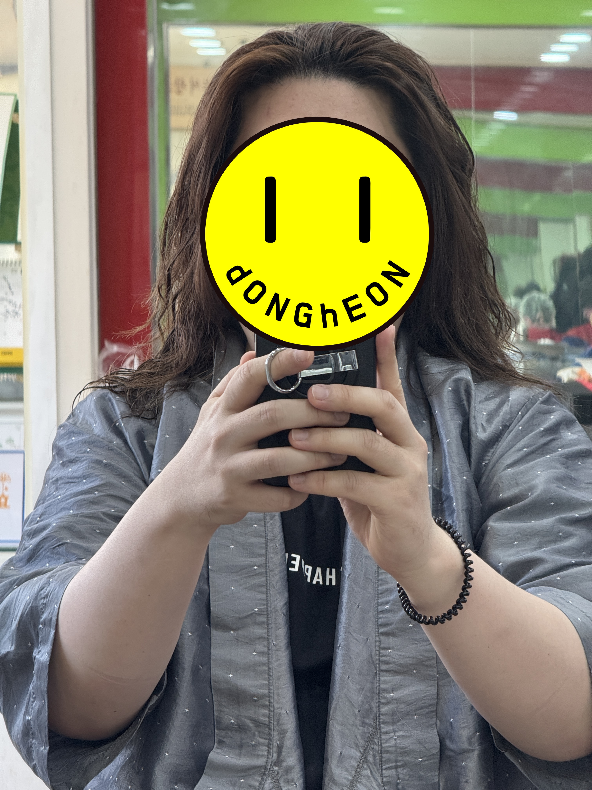
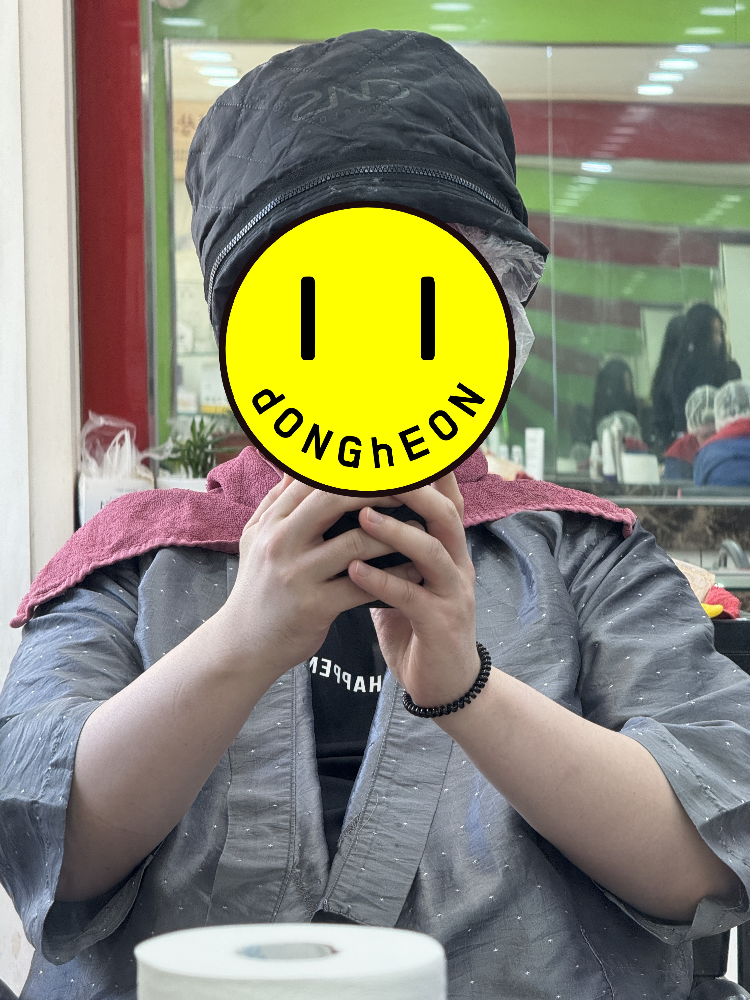
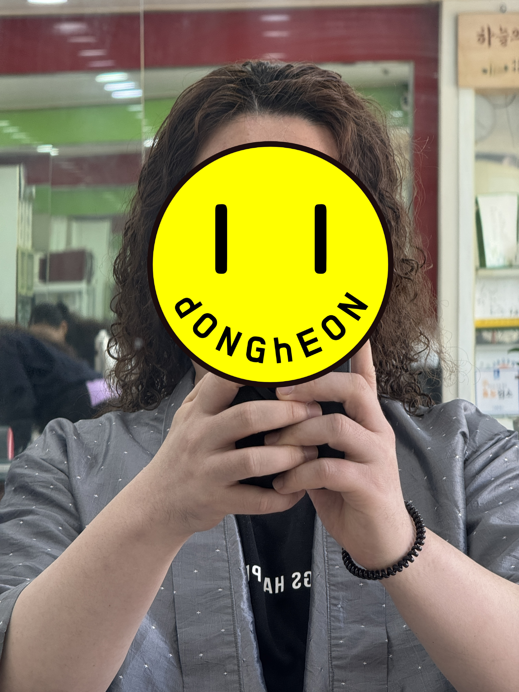
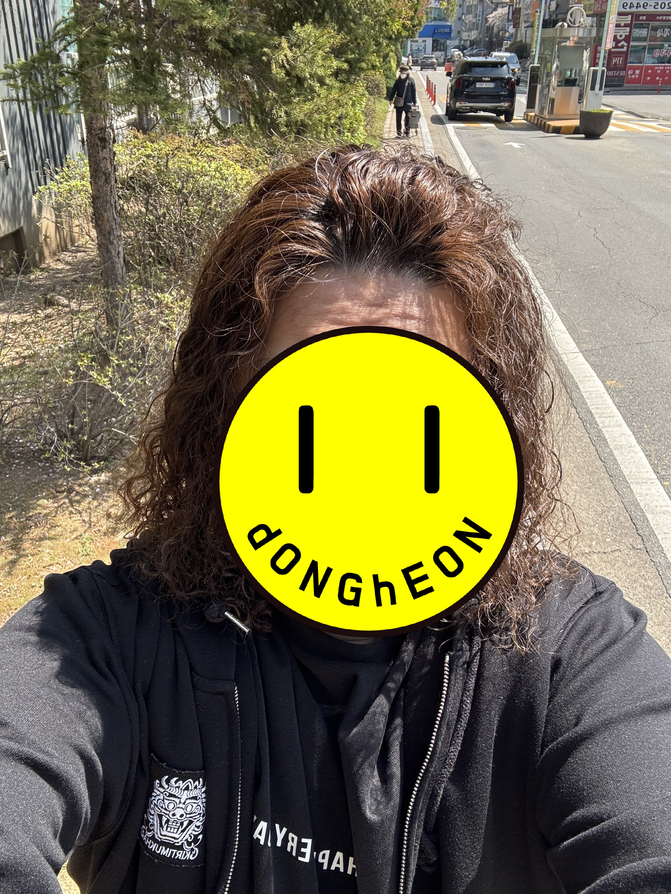

+++
date = '2026-04-08T18:04:40+09:00'
draft = false
title = '까꼬뽀꼬 미용실 리뷰'
tags = ['히피펌']
categories = ['인생']

+++

### 별점 : ★★★★★

<iframe src="https://www.google.com/maps/embed?pb=!1m18!1m12!1m3!1d20166.245533131485!2d127.05221952465662!3d37.24807568684908!2m3!1f0!2f0!3f0!3m2!1i1024!2i768!4f13.1!3m3!1m2!1s0x357b44eada4c9a3b%3A0x8ab0c82b89d2e0b5!2z6rmM6rys672A6rys!5e0!3m2!1sko!2skr!4v1775639238430!5m2!1sko!2skr" width="600" height="450" style="border:0;" allowfullscreen="" loading="lazy" referrerpolicy="no-referrer-when-downgrade"></iframe>

가죽공방 다녀오는 길에 문득 간판이 보였다. **"히피펌 전문"**

기분전환 겸 머리에 뭔짓을 할까 고민하던 차에, 잘됬다 싶어 오늘 아침에 전화해서 예약 잡고, 청소하고 씻고 바로 다녀옴.

결론부터 말하자면....굳! 며칠 지나봐야 알겠지만, 잘 안풀리게 오래가게 강하게 해달라고 요청드렸으니....오래 가겠지?

가격은 7.5만원

너무 못생겨서 얼굴은 좀 가리자...

이쯤해서 원장님이 커피를 권하심.

안마신다고 했더니 요구르트를 주셨다....ㅋㅋㅋㅋㅋ 감사해라. 그러고나서 컵라면도 권하심...서비스는 감사하나 굳이 점심으로 컵라면을 먹고싶지는 않아서 정중히 사양..

투블럭을 권하셨으나, 어무이가 투블럭을 별로 안좋아하시기에 그냥 구렛나루는 다듬어달라고 했음.

다시한번 결론 : 괜찮았음.

아, 한가지 힘들었던건...원장님이 매우매우 외향적이시다. 25년 전 이곳에서 오픈하셨고, 그 이후에 모 미용실이 들어섰고, 그때당시 수원에서 가장 빨리 히피펌을 하셨고....등등 역사도 알 수 있었다. 가족관계도 궁금해하셨고, 직업도 말씀드려야 했는데, 음....극 I 로서는 조금 힘들...었다. 내가 E 였으면 원장님이랑 친구먹고 올 수 있었을듯?

~~문권사님 죄송해요...다음엔 문헤어로 갈게요.~~

